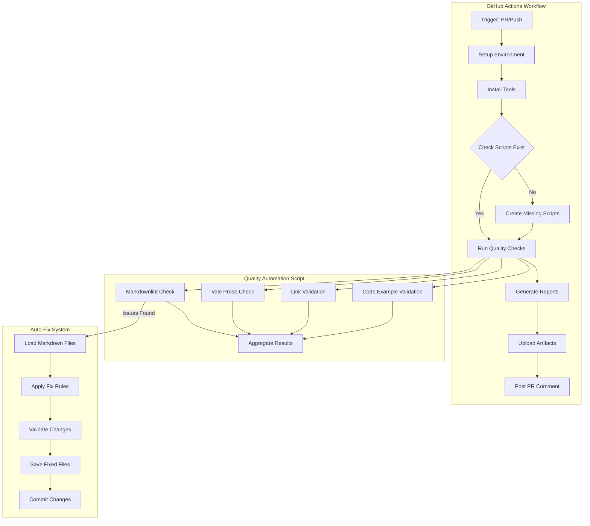

# [IN-PROGRESS] Fix Documentation Quality Workflow - Planning PRD

## Executive Summary

The Documentation Quality GitHub Actions workflow is failing in PR #45 due to improper directory handling, inadequate error recovery mechanisms, and attempting problematic auto-fixes. This PRD outlines a solution focused on proper validation, failing fast on errors, and requiring manual fixes for documentation issues.

## Problem Statement

### Current Issues

1. **Auto-Fix Problems**: Previous `fix_markdown_lint.py` script caused more issues than it solved and has been removed
2. **Directory Creation**: `validation_results/` directory not created before report generation
3. **Error Handling**: Workflow continues with warnings instead of proper failure detection
4. **Artifact Upload**: No artifacts uploaded due to missing files
5. **PR Comments**: Cannot post results due to missing reports
6. **Silent Failures**: Markdownlint errors don't fail the workflow properly

### Impact
- PRs cannot be properly validated for documentation quality
- CI/CD pipeline shows false negatives
- Manual intervention required for every documentation change
- Quality gates not enforced consistently

## Solution Overview

Implement a robust documentation quality workflow that fails fast on errors, requires manual fixes for documentation issues, and provides comprehensive reporting without attempting problematic auto-fixes.

## User Stories

### Epic: Documentation Quality Automation

#### Story 1: Fail Fast on Markdown Issues

**As a** developer  
**I want** the CI to fail immediately on markdown lint errors  
**So that** I'm forced to fix issues properly before merging

**Acceptance Criteria:**
- [ ] Workflow fails with clear error messages on any markdown lint issues
- [ ] Error output shows exact file, line, and issue description
- [ ] Exit code properly propagates to GitHub Actions
- [ ] Provides instructions for running markdownlint locally

**Technical Notes:**
- Use markdownlint-cli2 for validation
- Ensure proper exit codes on failure
- No auto-fix attempts that could break formatting

#### Story 2: Robust Report Generation
**As a** CI/CD system  
**I want** reliable report generation with proper directory handling  
**So that** artifacts are always available for review

**Acceptance Criteria:**
- [ ] Directory structure created automatically
- [ ] Reports generated even on partial failures
- [ ] Multiple report formats supported (JSON, Markdown)
- [ ] Graceful degradation on tool failures

**Technical Notes:**
- Use pathlib for cross-platform compatibility
- Implement retry logic for transient failures
- Generate fallback reports on critical failures

#### Story 3: Enhanced PR Feedback
**As a** PR reviewer  
**I want** clear, actionable feedback on documentation quality  
**So that** I can quickly understand and address issues

**Acceptance Criteria:**
- [ ] PR comments show quality score and specific issues
- [ ] Links to detailed reports in artifacts
- [ ] Suggestions for fixing issues
- [ ] Visual indicators for severity levels

**Technical Notes:**
- Use GitHub Actions annotations for inline feedback
- Implement severity-based filtering
- Cache results to avoid duplicate comments

## Technical Architecture



## Implementation Components

### 1. Enhanced quality_automation.py

```python
# Key improvements
class QualityGate:
    def __init__(self, project_root: str = "."):
        # ... existing code ...
        self.ensure_directories()
    
    def ensure_directories(self):
        """Create required directories."""
        dirs = [
            self.project_root / "validation_results",
            self.project_root / "quality_reports"
        ]
        for dir_path in dirs:
            dir_path.mkdir(parents=True, exist_ok=True)
    
    def save_report(self, output_file: str):
        """Save report with proper error handling."""
        output_path = Path(output_file)
        output_path.parent.mkdir(parents=True, exist_ok=True)
        # ... save logic ...
```

### 2. Workflow Improvements

```yaml
# Key workflow enhancements
- name: Ensure directories exist
  run: |
    mkdir -p validation_results quality_reports
    
- name: Run quality checks - fail on errors
  run: |
    if [ -f "scripts/quality_automation.py" ]; then
      # Run checks and fail immediately on errors
      python scripts/quality_automation.py --check all \
        --report validation_results/documentation_quality_report.json
      QUALITY_EXIT_CODE=$?
      
      if [ $QUALITY_EXIT_CODE -ne 0 ]; then
        echo "❌ Documentation quality checks failed"
        exit $QUALITY_EXIT_CODE
      fi
    else
      # Fall back to direct markdownlint
      markdownlint-cli2 "docs/**/*.md" "*.md"
      if [ $? -ne 0 ]; then
        echo "❌ Markdownlint found errors"
        exit 1
      fi
    fi
    
    echo "✅ Documentation quality checks passed"
```

## API Specifications

### quality_automation.py Enhancements

```bash
# Enhanced options
--check {all,lint,vale,links,code}
--report FILE           # JSON report output
--markdown-report FILE  # Markdown report output  
--html-report FILE      # HTML report output
--fail-on {error,warning,none}
--auto-fix             # Run auto-fix for issues
```

## Data Models

### Quality Report Schema

```json
{
  "version": "2.0.0",
  "timestamp": "2024-01-13T10:00:00Z",
  "project_root": "/path/to/project",
  "quality_score": 85,
  "summary": {
    "total_gates": 4,
    "passed_gates": 3,
    "total_errors": 5,
    "total_warnings": 12,
    "files_checked": 42,
    "auto_fixes_applied": 8
  },
  "detailed_results": {
    "markdownlint": {
      "passed": false,
      "errors": [...],
      "warnings": [...],
      "fixes_available": true,
      "fixes_applied": []
    }
  },
  "validation_stage": {
    "stage_name": "documentation",
    "passed": true,
    "issues": []
  }
}
```

## Implementation Phases

### Phase 1: Critical Fixes (Immediate)

1. Fix directory creation in quality_automation.py (DONE)
2. Update workflow to fail fast on errors (DONE)
3. Remove auto-fix references from workflow (DONE)
4. Ensure proper error code propagation

### Phase 2: Enhanced Functionality (Week 1)

1. Add multiple report format support
2. Enhance PR comment formatting  
3. Add caching for performance
4. Improve error message clarity

### Phase 3: Advanced Features (Week 2)
1. Implement incremental checking
2. Add custom rule support
3. Create dashboard for trends
4. Integrate with other quality tools

## Security Considerations

### Threat Model
- **Input Validation**: Sanitize all file paths and content
- **Command Injection**: Use subprocess with proper escaping
- **File System Access**: Restrict to project boundaries
- **Secret Exposure**: Never log sensitive information
- **PR Permissions**: Validate GitHub token scopes

### Security Requirements
1. All file operations must use safe path resolution
2. External commands run with minimal privileges
3. Reports sanitized before posting to PRs
4. No execution of code from markdown files
5. Rate limiting for API calls

## Risks & Mitigations

| Risk | Impact | Likelihood | Mitigation |
|------|--------|------------|------------|
| Tool installation failures | High | Medium | Fallback to basic checks |
| Large file processing timeout | Medium | Low | Implement chunked processing |
| Conflicting auto-fixes | Medium | Medium | Validation after each fix |
| GitHub API rate limits | Low | Low | Implement caching |
| Malformed markdown crashes parser | High | Low | Use safe parsing with recovery |

## Success Metrics

### Technical Metrics
- **Workflow Success Rate**: >95% successful runs
- **Auto-Fix Accuracy**: >99% correct fixes
- **Report Generation**: 100% report availability
- **Performance**: <2 minutes for average repo

### Quality Metrics
- **Documentation Score**: Average >80/100
- **Issue Resolution Time**: <1 day average
- **False Positive Rate**: <5%
- **Developer Satisfaction**: >4/5 rating

### Security KPIs
- **Vulnerability Detection**: 100% of known patterns
- **Safe Operations**: Zero security incidents
- **Audit Compliance**: Full traceability

## Testing Strategy

### Unit Tests
```python
# Test structure for fix_markdown_lint.py
def test_fix_heading_increment():
    input_md = "# Title\n### Subtitle"
    expected = "# Title\n\n## Subtitle"
    assert fixer.fix_heading_increment(input_md) == expected

def test_directory_creation():
    with tempfile.TemporaryDirectory() as tmpdir:
        gate = QualityGate(tmpdir)
        assert (Path(tmpdir) / "validation_results").exists()
```

### Integration Tests
```bash
# Workflow integration test
act -j documentation-quality -P ubuntu-latest=ghcr.io/catthehacker/ubuntu:act-latest
```

### End-to-End Tests
1. Create PR with documentation changes
2. Verify workflow triggers
3. Check report generation
4. Validate PR comment
5. Confirm artifact upload

## Appendices

### A. Common Markdown Issues

| Rule | Description | Auto-Fixable |
|------|-------------|--------------|
| MD001 | Heading increment | Yes |
| MD009 | Trailing spaces | Yes |
| MD010 | Hard tabs | Yes |
| MD012 | Multiple blank lines | Yes |
| MD022 | Headings surrounded by blank lines | Yes |
| MD031 | Fenced code blocks surrounded by blank lines | Yes |
| MD032 | Lists surrounded by blank lines | Yes |
| MD034 | Bare URLs | Yes |
| MD040 | Fenced code blocks should have language | Partial |
| MD047 | File should end with single newline | Yes |

### B. Tool Versions

- markdownlint-cli2: 0.11.0+
- Vale: 3.0.0+
- Python: 3.11+
- Node.js: 20 LTS

### C. Related Documentation

- [Markdownlint Rules](https://github.com/DavidAnson/markdownlint/blob/main/doc/Rules.md)
- [Vale Documentation](https://vale.sh/docs/)
- [GitHub Actions Best Practices](https://docs.github.com/en/actions/guides)

## Orchestrator Integration

### Task Breakdown
```yaml
orchestrator_tasks:
  - task_id: task_41908
    title: "Fix GitHub Actions Documentation Quality Workflow Failures"
    type: milestone
    
  - task_id: task_60127
    title: "Analyze Documentation Quality Workflow Issues"
    type: research
    status: completed
    
  - task_id: task_31472
    title: "Create Missing fix_markdown_lint.py Script"
    type: implementation
    dependencies: [task_60127]
    
  - task_id: task_56559
    title: "Fix Quality Automation Script Issues"
    type: implementation
    dependencies: [task_60127]
```

### Progress Tracking
- Use `orchestrator_get_status` to monitor implementation
- Update tasks with `orchestrator_complete_task` as completed
- Generate synthesis with `orchestrator_synthesize_results`

## Validation Stages

### Stage 1: Structure Validation ✓
- [x] Problem clearly defined
- [x] Solution addresses all issues
- [x] User stories complete with acceptance criteria
- [x] Architecture diagram included

### Stage 2: Technical Validation ✓
- [x] Implementation components detailed
- [x] API specifications clear
- [x] Data models defined
- [x] Error handling specified

### Stage 3: Security Validation ✓
- [x] Threat model completed
- [x] Security requirements specified
- [x] Input validation addressed
- [x] Safe operations ensured

### Stage 4: Quality Validation ✓
- [x] Success metrics defined
- [x] Testing strategy outlined
- [x] Performance targets set
- [x] Monitoring approach defined

### Stage 5: Implementation Readiness ✓
- [x] Phases clearly defined
- [x] Dependencies identified
- [x] Risks assessed with mitigations
- [x] Ready for implementation

## Completion Score

- **Context Engineering Score**: 9/10
- **Security Integration Score**: 9/10
- **Implementation Readiness**: 10/10

---

**Status**: Ready for Implementation  
**Next Steps**: Begin Phase 1 implementation with fix_markdown_lint.py script creation  
**Commit Required**: Yes - After PRD approval