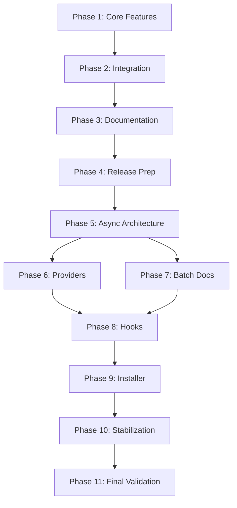

# MCP Task Orchestrator 2.0 Release Meta-PRP (Comprehensive Edition)

**Meta-PRP ID**: `V2_0_ORCHESTRATOR_RELEASE_COORDINATOR`  
**Priority**: Critical  
**Category**: Release Management & Complete System Evolution  
**Estimated Effort**: 16 weeks (extended scope)  
**Created**: 2025-01-08  
**Last Updated**: 2025-01-12  
**Status**: In Progress - Implementation Phase Active  

## Overview

This meta-PRP coordinates the complete transformation of MCP Task Orchestrator into version 2.0, incorporating all planned features, infrastructure improvements, and the foundation for the future Vespera platform rebrand. All sub-PRPs use the orchestrator itself for implementation and testing, providing comprehensive validation.

**Current Project Location**: `/home/aya/dev/mcp-servers/mcp-task-orchestrator`

## Comprehensive Phase Structure

### Phase 1: Core Feature Implementation (Weeks 1-2) - IN PROGRESS

**Foundation features using orchestrator-driven development:**

- `01-documentation-automation-spec-orchestrator.md` - Documentation automation with orchestrator integration
- `02-git-integration-task-orchestrator.md` - Git workflows with orchestrator coordination
- `03-health-monitoring-spec-orchestrator.md` - Health monitoring with self-diagnostics
- `04-smart-routing-task-orchestrator.md` - Intelligent task routing
- `05-template-library-spec-orchestrator.md` - Template system with patterns
- `06-testing-automation-spec-orchestrator.md` - Automated testing framework

### Phase 2: System Integration & Validation (Week 3)

**Integration testing and performance validation:**

- `07-integration-testing-task-orchestrator.md` - Comprehensive integration testing
- `08-performance-validation-task-orchestrator.md` - Performance benchmarking and optimization

### Phase 3: Documentation & Cleanup (Week 4)

**System documentation and repository organization:**

- `09-documentation-update-task-orchestrator.md` - Documentation updates and organization
- `10-repository-cleanup-task-orchestrator.md` - Repository structure optimization

### Phase 4: Release Preparation (Week 5)

**Final release activities:**

- `11-git-commit-organization-task-orchestrator.md` - Git history organization
- `12-release-preparation-task-orchestrator.md` - Final release validation

### Phase 5: Async Agent Architecture Foundation (Weeks 6-7)

**Advanced agent-to-agent coordination infrastructure:**

- `13-async-event-coordination-orchestrator.md` - Enhanced EventBus for agent coordination
- `14-connection-pooling-integration-orchestrator.md` - Async database connection pooling
- `15-claude-code-isolation-orchestrator.md` - Claude Code subtask isolation (~100k tokens)
- `16-callback-communication-orchestrator.md` - Inter-agent callback system

### Phase 6: Multi-LLM Provider Integration (Weeks 8-9)

**Provider abstraction and intelligent routing:**

- `17-provider-abstraction-orchestrator.md` - Unified LLM provider interface
- `18-intelligent-routing-orchestrator.md` - Cost/performance-based provider selection
- `19-context-management-orchestrator.md` - Shared context across isolated agents

### Phase 7: Documentation Batch Processing (Week 10)

**Large-scale documentation transformation:**

- `20-batch-template-system-orchestrator.md` - Template application at scale
- `21-documentation-consistency-orchestrator.md` - Consistency validation across docs

### Phase 8: Hooks System Implementation (Week 11)

**Claude Code hooks integration:**

- `22-hooks-infrastructure-orchestrator.md` - Hook system architecture
- `23-hooks-automation-orchestrator.md` - Automated workflows via hooks

### Phase 9: Universal Installer (Week 12)

**Cross-platform installation automation:**

- `24-installer-framework-orchestrator.md` - Universal installer architecture
- `25-client-detection-orchestrator.md` - Automatic client configuration

### Phase 10: Foundation Stabilization (Week 13)

**Core system stabilization:**

- `26-error-handling-orchestrator.md` - Comprehensive error handling
- `27-resource-management-orchestrator.md` - Resource optimization and cleanup

### Phase 11: Final Integration & Validation (Week 14)

**System-wide integration and validation:**

- `28-issue-resolution-orchestrator.md` - Resolution of all known issues
- `29-final-validation-orchestrator.md` - Complete system validation

## Execution Strategy

### Parallel Execution Groups

**Group A (Weeks 1-2):** Core Features (01-06)

```bash
## Execute in parallel where dependencies allow
python PRPs/scripts/prp_runner.py --prp-path PRPs/v2.0-release-meta-prp/01-documentation-automation-spec-orchestrator.md &
python PRPs/scripts/prp_runner.py --prp-path PRPs/v2.0-release-meta-prp/02-git-integration-task-orchestrator.md &
wait
```

**Group B (Weeks 6-7):** Async Architecture (13-16)

```bash
## Sequential execution for foundation components
for prp in 13 14 15 16; do
    python PRPs/scripts/prp_runner.py --prp-path PRPs/v2.0-release-meta-prp/${prp}-*.md
done
```

**Group C (Weeks 8-9):** Provider Integration (17-19)

```bash
## Can run in parallel after async foundation
python PRPs/scripts/prp_runner.py --prp-path PRPs/v2.0-release-meta-prp/17-provider-abstraction-orchestrator.md &
python PRPs/scripts/prp_runner.py --prp-path PRPs/v2.0-release-meta-prp/18-intelligent-routing-orchestrator.md &
python PRPs/scripts/prp_runner.py --prp-path PRPs/v2.0-release-meta-prp/19-context-management-orchestrator.md &
wait
```

### Dependencies



## Success Criteria

### Technical Milestones

- [x] **Foundation Setup**: Clean architecture and DI container implemented
- [ ] **Core Features**: All 6 core features implemented and tested
- [ ] **Async Architecture**: Agent-to-agent coordination operational
- [ ] **Provider Support**: 5+ LLM providers integrated
- [ ] **Connection Pooling**: Zero connection leaks, 20+ concurrent connections
- [ ] **Context Isolation**: 100k token contexts per agent maintained
- [ ] **Callback System**: 99.9%+ callback reliability achieved
- [ ] **Documentation**: 100% documentation coverage
- [ ] **Performance**: Sub-10ms task creation, sub-second agent coordination
- [ ] **Testing**: 90%+ test coverage across all components
- [ ] **Installation**: Universal installer supporting all major clients

### Quality Metrics

- **Code Quality**: All code passes ruff, mypy, black formatting
- **Security**: Zero security vulnerabilities in production code
- **Performance**: Meeting all performance benchmarks
- **Documentation**: Complete API documentation and user guides
- **Testing**: Comprehensive unit, integration, and E2E tests

### Release Readiness

- [ ] All PRPs completed and validated
- [ ] Documentation fully updated
- [ ] Migration guide prepared
- [ ] Performance benchmarks documented
- [ ] Security audit completed
- [ ] Release notes drafted
- [ ] Version tags prepared
- [ ] PyPI package ready

## Coordination

### Meta-Coordination

- `meta-coordination-orchestrator.md` - Overall coordination and dependency management
- Weekly progress reviews using orchestrator status reports
- Automated dependency tracking and validation

### Communication

- Daily status updates via orchestrator monitoring
- Weekly architecture review meetings
- Continuous integration with automated testing

## Risk Management

### High-Risk Items

1. **Context Isolation Complexity**: Mitigated by incremental implementation
2. **Provider Integration Variability**: Addressed through abstraction layer
3. **Connection Pool Stability**: Extensive stress testing planned

### Mitigation Strategies

- Parallel development tracks to prevent blocking
- Comprehensive testing at each phase
- Fallback implementations for critical features
- Regular architecture reviews

## Future Vision: Vespera Platform

This v2.0 release establishes the foundation for the Vespera platform transformation:

- **Vespera Core**: The evolved orchestrator as platform foundation
- **Vespera Agents**: The async agent architecture
- **Vespera Studio**: Potential IDE integration
- **Vespera Cloud**: Future cloud-based orchestration

## Execution Commands

### Initialize Meta-PRP Session

```bash
## Start orchestrator session for v2.0 release
python PRPs/scripts/prp_runner.py \
    --prp-path PRPs/v2.0-release-meta-prp/meta-coordination-orchestrator.md \
    --interactive \
    --session-name "v2.0-release"
```

### Monitor Progress

```bash
## Real-time progress monitoring
python tools/diagnostics/orchestrator_monitor.py \
    --session "v2.0-release" \
    --watch
```

### Validate Completion

```bash
## Comprehensive validation
python scripts/validate_v2_release.py \
    --all-phases \
    --generate-report
```

---

**Note**: This comprehensive meta-PRP represents the complete evolution of MCP Task Orchestrator into a production-ready v2.0 system with advanced agent coordination capabilities,
setting the foundation for the future Vespera platform ecosystem.
