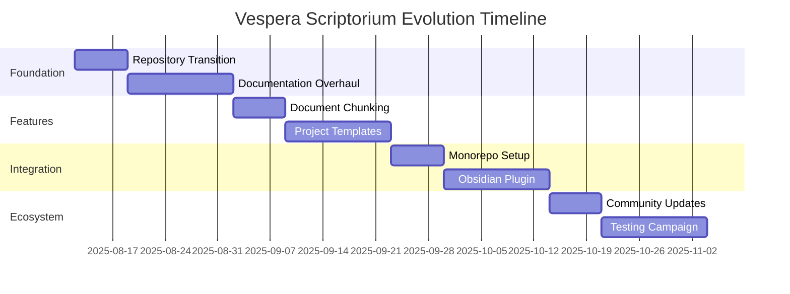

# Vespera Scriptorium Evolution - Complete Platform Transition Meta-PRP

**Meta-PRP ID**: `VESPERA_SCRIPTORIUM_EVOLUTION_2025`  
**Type**: Platform Evolution & Integration Meta-Coordination  
**Priority**: Critical - Platform Direction  
**Estimated Total Effort**: 8-12 weeks  
**Created**: 2025-08-12  
**Status**: [READY]  

## Executive Summary

Transform the **MCP Task Orchestrator** into **Vespera Scriptorium** - a core component of the Vespera Atelier platform. This evolution repositions the project from a standalone task orchestrator to a document-centric "IDE for ideas" that supports creative writing, research projects, and software development through intelligent document management and multi-agent coordination.

## Vision: From Orchestrator to Scriptorium

### The Core Insight

> **"An IDE for ideas, not just code"**

The Vespera Atelier platform represents a paradigm shift from code-centric development tools to **idea-centric creation tools**. Vespera Scriptorium becomes the core engine that manages, organizes, and intelligently processes documents, knowledge, and creative workflows.

### Why "Scriptorium"?

**Historical Context**: Medieval scriptoriums were centers of knowledge preservation, document creation, and intellectual collaboration.

**Modern Application**: 
- **Document Management**: Core organizational capability
- **Knowledge Synthesis**: RAG and graph database integration
- **Creative Workflows**: Support for writing, research, and ideation
- **Multi-Agent Coordination**: Collaborative intelligence systems
- **Atelier Integration**: Natural fit within a creative workshop environment

## Platform Architecture Evolution

### Current State: MCP Task Orchestrator
```
Standalone MCP Server
├── Task Management
├── SQLite Database
├── Basic Agent Coordination
└── Code-Focused Workflows
```

### Target State: Vespera Scriptorium
```
Vespera Scriptorium (Dual-Mode Architecture)
├── Standalone MCP Server Mode (backward compatibility)
├── Integrated Atelier Component Mode (platform integration)
├── Multi-Database Architecture
│   ├── SQLite (operational/transactional)
│   ├── ChromaDB (vector embeddings/RAG)
│   └── Neo4j (knowledge graph)
├── Document Automation Engine
├── Multi-Agent Session Management
├── Project-Type Templates
│   ├── Creative Writing Projects
│   ├── Research Projects
│   └── Software Development Projects
└── Obsidian Plugin Integration (future GUI)
```

## Phase 1: Technical Foundation (Weeks 1-3)

### 1.1 Repository Transition
- **Rename Project**: `mcp-task-orchestrator` → `vespera-scriptorium`
- **Update PyPI Package**: Migrate from broken `mcp-task-orchestrator` to `vespera-scriptorium`
- **GitHub Repository**: Create new `vespera-scriptorium` repository
- **Awesome MCP Servers**: Update listing with new name and working installation

### 1.2 Documentation Overhaul
**Automated Documentation Update System**:
```yaml
documentation_automation:
  triggers:
    - code_change_completion
    - feature_implementation
    - api_modification
  
  agents:
    documentation_agent:
      role: "Update technical documentation to match code changes"
      inputs: ["code_diffs", "commit_messages", "artifacts"]
      outputs: ["updated_docs", "api_reference_updates"]
    
    github_automation_agent:
      role: "Handle git operations and pushes"
      inputs: ["documentation_updates"]
      outputs: ["committed_changes", "pushed_updates"]
```

### 1.3 Backwards Compatibility
- Maintain `mcp-task-orchestrator` as alias/wrapper
- Preserve all existing MCP tool names
- Ensure seamless migration for current users (if any exist)

## Phase 2: Scriptorium Feature Integration (Weeks 4-6)

### 2.1 Document Chunking System Migration
**From Private Scriptorium Repository**:
- Advanced document chunking for large files
- Local LLM integration for small context windows
- Document search and synthesis capabilities
- Integration with vector database for semantic search

### 2.2 Enhanced Project Type Support

#### Creative Writing Projects
```yaml
creative_writing_template:
  managed_documents:
    - /manuscripts/chapters/
    - /world_building/characters.md
    - /world_building/locations.md
    - /plot/timeline.md
    - /research/inspiration.md
  
  database_integration:
    vector_db:
      - character_descriptions
      - plot_points
      - world_building_elements
    graph_db:
      - character_relationships
      - plot_connections
      - world_coherence_tracking
  
  automation_triggers:
    - chapter_completion
    - character_development
    - plot_milestone_achievement
```

#### Research Projects  
```yaml
research_project_template:
  managed_documents:
    - /literature_review/sources.md
    - /methodology/experimental_design.md
    - /data/analysis_results.md
    - /findings/conclusions.md
  
  rag_capabilities:
    - automatic_citation_tracking
    - hypothesis_evolution_mapping
    - result_correlation_analysis
    - literature_gap_identification
```

#### Software Development Projects
```yaml
software_development_template:
  managed_documents:
    - /docs/API_REFERENCE.md
    - /docs/ARCHITECTURE.md
    - /docs/CHANGELOG.md
    - /docs/DEPLOYMENT.md
  
  automation:
    - api_documentation_generation
    - architecture_diagram_updates
    - changelog_from_commits
    - deployment_guide_maintenance
```

## Phase 3: Vespera Atelier Integration (Weeks 7-9)

### 3.1 Monorepo Integration
**Target Structure**:
```
/home/dev/monorepo/vespera-atelier/
├── packages/
│   ├── vespera-scriptorium/          # Core MCP server
│   ├── vespera-atelier-desktop/      # Desktop application
│   ├── vespera-obsidian-plugin/      # Obsidian integration
│   └── vespera-web-interface/        # Web dashboard
├── shared/
│   ├── types/                        # Shared TypeScript types
│   ├── database-schemas/             # Database definitions
│   └── mcp-protocols/                # MCP protocol definitions
└── docs/
    ├── platform-overview.md
    ├── integration-guides/
    └── api-documentation/
```

### 3.2 Cross-Component Communication
- **MCP Protocol Extensions**: Custom tools for Atelier integration
- **Shared Database Access**: Multi-component database coordination
- **Event System**: Cross-component notification and synchronization

### 3.3 Obsidian Plugin Revival
**Transform Private Plugin** → **Vespera Atelier GUI**:
- Document visualization and navigation
- Real-time sync with Scriptorium backend
- Creative workflow interfaces
- Research project management UI

## Phase 4: Community & Ecosystem (Weeks 10-12)

### 4.1 GitHub Ecosystem Updates
**Reference Update Campaign**:
- **Awesome MCP Servers**: Update with working installation and new name
- **PyPI Migration**: Deprecation notice + new package publication
- **MCP Registry**: Update official listings
- **Documentation Sites**: Update external references
- **Community Forums**: Announcement and migration guide

### 4.2 Testing Infrastructure
**Multi-Platform Validation**:
- ✅ **Windows WSL**: Current testing environment
- 🔄 **Native Linux**: Priority testing target
- 🤝 **macOS**: Community testing program
- 📱 **Container Environments**: Docker validation

### 4.3 Installation System Overhaul
**Universal Installer Enhancement**:
```bash
# Simple installation
curl -sSL https://install.vespera.dev/scriptorium | bash

# Or via package managers
pip install vespera-scriptorium
npm install -g vespera-scriptorium-cli
```

## Implementation Strategy: Multi-Agent Coordination

### Meta-Agent Coordination
```yaml
scriptorium_evolution_workflow:
  session_management:
    primary_session: "vespera-scriptorium-evolution-2025"
    cross_agent_coordination: true
    artifact_sharing: enabled
    
  specialized_agents:
    renaming_agent:
      role: "Handle all naming transitions and reference updates"
      tasks:
        - repository_renaming
        - package_migration  
        - documentation_updates
        - external_reference_tracking
    
    integration_agent:
      role: "Manage Atelier platform integration"
      tasks:
        - monorepo_structure_design
        - cross_component_protocols
        - shared_resource_management
    
    documentation_agent:
      role: "Comprehensive documentation overhaul"
      tasks:
        - platform_vision_documentation
        - api_reference_updates
        - user_migration_guides
        - developer_integration_docs
    
    testing_agent:
      role: "Multi-platform testing coordination"
      tasks:
        - installation_validation
        - platform_compatibility_testing
        - regression_testing
        - performance_validation
```

### Artifact-Centric Workflow
**Critical Principle**: All detailed work stored in artifacts, enabling:
- Cross-agent knowledge sharing
- Historical implementation tracking  
- Vector database population for RAG
- Graph database relationship mapping
- Automated documentation generation

## Success Metrics

### Technical Metrics
1. **Dual-Mode Operation**: Both standalone MCP + Atelier integration working
2. **Installation Success Rate**: >95% across target platforms
3. **Database Performance**: <100ms query response times
4. **Documentation Coverage**: 100% API coverage with examples

### Platform Metrics  
1. **Project Type Support**: 3 complete templates (creative, research, code)
2. **Cross-Agent Coordination**: Session management across 5+ agent types
3. **Document Automation**: Automatic updates for 10+ document types
4. **RAG Integration**: Semantic search across all project artifacts

### Ecosystem Metrics
1. **Reference Updates**: All external references migrated to new identity
2. **Community Adoption**: Active users across 3 platforms
3. **Integration Depth**: Obsidian plugin functional with Scriptorium backend
4. **Repository Health**: Clean GitHub presence with active community

## Risk Mitigation

### Technical Risks
- **Breaking Changes**: Comprehensive backwards compatibility testing
- **Database Migration**: Automated migration scripts with rollback capability
- **Performance Regression**: Continuous performance monitoring
- **Integration Complexity**: Modular integration with fallback modes

### Ecosystem Risks
- **Community Confusion**: Clear communication and migration guides
- **Reference Rot**: Systematic external reference tracking and updates
- **Installation Failures**: Multi-platform testing and validation
- **Platform Fragmentation**: Unified documentation and consistent APIs

## Timeline Overview



## Critical Dependencies

### Internal Dependencies
1. **Current Branch**: `vespera-integration-prep` must be tested and validated
2. **Database Architecture**: Multi-database system must be stable
3. **Session Management**: Cross-agent coordination must be reliable
4. **Artifact System**: Document automation must be functional

### External Dependencies
1. **Vespera Atelier Monorepo**: GitHub repository creation and structure
2. **PyPI Migration**: Package name availability and transfer process
3. **Obsidian Plugin**: Access to private repository for integration
4. **Community Testing**: macOS and native Linux testing volunteers

## Next Immediate Actions

1. **Fix CI Pipeline**: Add requirements.txt (in progress)
2. **Clean Branch History**: Remove merged branches for clarity
3. **Update PR Description**: Include Vespera vision and transition plan
4. **Create GitHub Repository**: `vespera-scriptorium` with migration notice
5. **Begin Phase 1**: Repository renaming and documentation overhaul

## Long-Term Vision Impact

This transition represents more than a rename - it's the foundation for **Vespera Atelier** as a comprehensive creative platform:

- **Document-Centric Workflows**: Moving beyond code to ideas and content
- **Multi-Domain Support**: Creative writing, research, software development  
- **Intelligent Automation**: RAG-powered document management and synthesis
- **Collaborative Intelligence**: Multi-agent systems for complex creative tasks
- **Platform Extensibility**: Plugin architecture for domain-specific workflows

**Vespera Scriptorium** becomes the intelligent core that transforms how people organize, develop, and synthesize complex ideas across multiple domains.

---

*This meta-PRP coordinates the complete evolution from MCP Task Orchestrator to Vespera Scriptorium, establishing the foundation for the broader Vespera Atelier platform.*